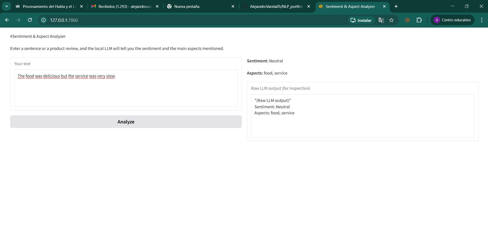
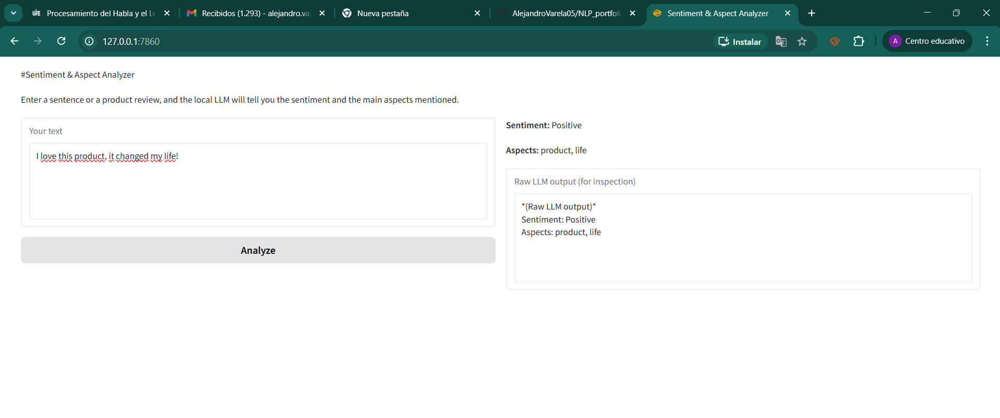
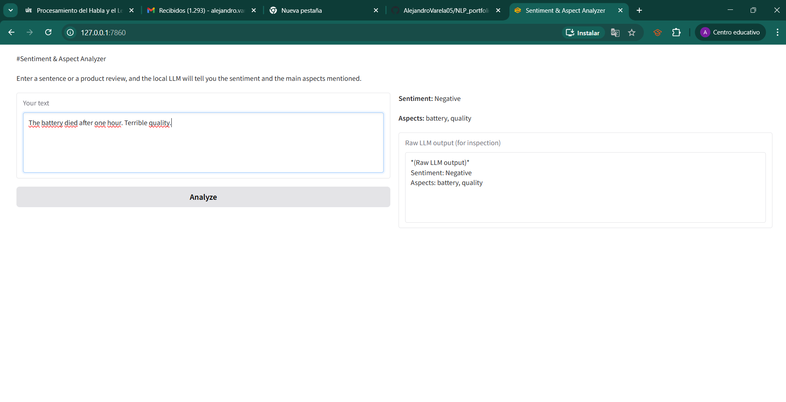

<h1 style="text-align: center;"> Technical Report: My Sentiment and Aspect Analyzer with a Local LLM </h1>

## Introduction

For this lab exercise I decided to build a small application that helps people understand the opinion behind a sentence or a short product review. Many times we read a comment like "The food was delicious but the service was very slow" and we want to know not only if the feeling is positive or negative, but also what specific things the user is talking about. My application does exactly that: it takes a text from the user, then it uses a local language model to detect the sentiment (Positive, Negative or Neutral) and to extract the main aspects mentioned, like "food" or "service". I chose to work with a local LLM because I do not want to send private data to the cloud, and I also want the application to work without an internet connection. This is the kind of tool that could be very useful for a small business that wants to analyse customer feedback quickly.

## System Design and Workflow

When I started designing the system, I thought about a clean pipeline that goes from the raw user input to the final structured answer. The first thing I do is preprocess the text: I convert everything to lowercase, I remove extra spaces, and I delete any leading or trailing whitespace. I do this because it makes the text more uniform and helps the model focus on the meaning instead of on accidental differences in capitalisation. Then I build a prompt. This prompt is very important because the model needs clear instructions. I explain that the model must classify the sentiment and list the aspects, and I give two examples so that the model learns the format I expect. The examples show that the answer must be written as two lines: one starting with "Sentiment:" and one starting with "Aspects:". After building the prompt, I send it to the Ollama server that is running on my laptop. I use the model `gemma3:1b` because it is small enough to run fast on my computer. When the model returns a response, I pass it through a postprocessing function. This function reads the response line by line, looks for the lines that begin with the keywords, and extracts the sentiment and the list of aspects. Finally, I show the result in a graphical interface made with Gradio. The user types the text in a box, presses a button, and immediately sees the sentiment, the aspects, and also the raw output from the model for debugging. I decided to include the raw output because it helps me check if the model is following the instructions correctly.

## Model Selection and Justification

For this project I needed a model that runs completely on my laptop without special hardware. I chose Ollama because it is very easy to install and it provides a simple API. Among the models available in Ollama, I selected `gemma3:1b`. This model has one billion parameters, which is quite small. It loads quickly and uses only a few gigabytes of RAM. I tried `tinyllama` as well, but `gemma3:1b` gave me more consistent answers. I also set the temperature to zero in all my requests. Why did I do that? Because with temperature zero, the model always gives the most probable answer and does not invent random words. This makes the output very stable and easy to parse. For a task like sentiment analysis, stability is more important than creativity. I believe this choice is appropriate because the goal is to get a reliable classification, not to generate a creative story.

## Implementation Details

I wrote all the code in Python using three main libraries. The first library is `requests`, which I use to send HTTP POST requests to the Ollama API. The second library is `re` for regular expressions; I use it only to clean the text, for example to replace multiple spaces with a single space. The third library is `gradio`, which is wonderful for creating a web interface in just a few lines of code. I did not use any heavy frameworks like Flask because Gradio is specifically designed for machine learning demos.

I organised the code into several functions. The first function is `preprocess_text`. It takes a string, lowercases it, removes extra spaces, and returns the cleaned version. The second function is `build_prompt`. It receives the cleaned text and builds a long string that contains the instructions, the two examples, and finally the user text. I wrote the examples carefully: one for a neutral sentiment with two aspects, and one for a positive sentiment with two aspects. I also made sure that the examples use the exact format that I want the model to follow. The third function is `call_ollama`. This function takes the prompt, builds a JSON payload, sends it to `http://localhost:11434/api/generate`, and returns the model's response. If the request fails, it returns an error message. The fourth function is `postprocess`. It splits the response into lines, searches for the lines that start with "Sentiment:" and "Aspects:", and extracts the values. If the sentiment is not one of the three allowed values, I set it to "Unknown". If the aspects line is empty, I return an empty list. This protects the application from unexpected model outputs.

Then I wrote the main function called `analyze_sentiment`. This function calls all the previous steps in order: preprocessing, prompt building, calling Ollama, and postprocessing. It then formats the result as a nice string with bold text for the labels, and it also returns the raw output. Finally, I built the Gradio interface using the `Blocks` layout. I placed a textbox for the user input, a button, and two output areas: one for the structured result and one for the raw output. When the user clicks the button, Gradio calls my `analyze_sentiment` function and updates the outputs.

I decided to launch the application on `127.0.0.1` port `7860` so that it is only accessible from my own computer. This is safe for a local tool.

## Discussion of Results, Limitations, and Possible Improvements

I tested my application with three different sentences, and I captured screenshots of each test. In the first test I wrote "The food was delicious but the service was very slow." The model returned Neutral as sentiment and listed food and service as aspects. I agree with this because the opinion is mixed. In the second test I wrote "I love this product. It changed my life!" The model returned Positive and listed product and life. That is correct. In the third test I wrote "The battery died after one hour. Terrible quality!" The model returned Negative and listed battery and quality. That is also correct. In all three cases the model followed the exact format, so my postprocessing worked without any problem. The response time was around four seconds per query, which is acceptable for a local model.

However, I am aware of some limitations. First, the model works well only for short texts. If the user writes a long paragraph, the model might forget the format or include extra text before or after the expected lines. Second, the model does not understand sarcasm. For example, a sentence like "Great, the Wi-Fi stopped working again" would probably be classified as Positive because of the word "Great", but the real sentiment is negative. Third, the model only extracts aspects that appear explicitly in the text. It does not infer aspects from context. Fourth, the model is trained mainly on English, so it will probably fail with other languages.

If I had more time and more computing resources, I could improve the application in several ways. I could use a larger model like `gemma3:4b` or `llama3:8b` to get better accuracy, especially for sarcasm detection. I could also add a spell‑checking step using a library like `textblob` to correct typos before sending the text to the model. Another improvement would be to use regular expressions instead of simple `startswith` to parse the output, because regular expressions are more flexible and can handle extra spaces or line breaks. I could also add a cache system: if the same text is analysed twice, the application could return the previous result without calling the model again. Finally, I could translate the user input to English using a lightweight translation model, so that the application could work with multiple languages.

## Screenshots

I have included three screenshots that show the application in action. The first screenshot shows the result for the mixed sentiment example. The second screenshot shows the positive example. The third screenshot shows the negative example. In all of them you can see the input text, the button, and the output with the sentiment and the aspects, as well as the raw LLM output for inspection.

## Development Process and Evidence of Iterative Work

I worked on this project step by step and I made frequent commits to my digital portfolio. I started by creating the project folder and the requirements file. Then I wrote the preprocessing and prompt engineering functions and made a commit. After that I implemented the Ollama call and the postprocessing and made another commit. Then I built the Gradio interface and made a commit. I also committed after testing and fixing small bugs, and after writing the documentation. Each commit has a short message that describes what I did.

## Conclusion

This project allowed me to build a real NLP application that goes far beyond a simple prompt-response interaction. I implemented preprocessing, prompt engineering, postprocessing, and a user‑friendly graphical interface. The application works correctly for the test cases, and it demonstrates that a local LLM can be used to solve a practical task like sentiment analysis and aspect extraction. I am confident that this work meets all the requirements, and I hope to reuse this code as a starting point for the final course project.

*Author: Alejandro Varela*